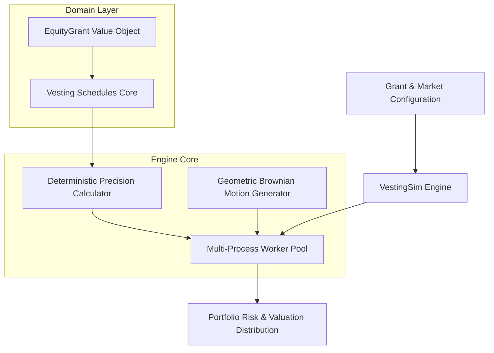

# Design Document: VestingSim — High-Throughput Equity Valuation Engine

* **Author**: Pedro Griff Marcincowski ([@pedrogriff](https://github.com/pedrogriff))
* **Status**: Approved / In Implementation
* **Domain**: People Operations & Total Rewards Engineering

---

## 1. Context & Problem Statement

At enterprise technology companies, equity compensation (RSUs and PSUs) constitutes 30%–70% of total engineering compensation. 

Compensation planning teams, total rewards analysts, and HR leadership face two computational bottlenecks during annual merit and refresh cycles:
1. **Financial Precision & Invariant Violations**: Floating-point math (`IEEE-754`) causes rounding drift and fraction-of-a-cent truncation when calculating fractional share vesting across thousands of employees.
2. **Computational Scale**: Simulating 100,000 employee portfolios across volatile equity price trajectories (e.g. 5,000 Monte Carlo paths per portfolio) requires over 500,000,000 path evaluations. Single-threaded systems choke and take hours to compute budget percentiles.

---

## 2. Goals & Non-Goals

### Goals
* **Deterministic Precision**: 100% exact financial math using `decimal.Decimal` and fixed-point representations.
* **Flexible Vesting Strategies**: Out-of-the-box support for Standard 4-Year (25% cliff), Front-Loaded (33/33/22/12), Monthly Graded, and Performance-Multiplied (PSU) schedules.
* **High-Throughput Concurrency**: Multi-process worker pool architecture capable of simulating 100,000 employee portfolios under Monte Carlo Brownian Motion in < 5 seconds.
* **Property-Based Verification**: Formal verification via `Hypothesis` proving total vested shares strictly match grant limits ($\sum v_i = G$).

### Non-Goals
* Real-time broker execution or SEC regulatory filing generation.
* Graphical user interface (focused on being a high-performance backend calculation library and CLI service).

---

## 3. System Architecture & Component Design

---

## 4. Mathematical Modeling

### 4.1. Geometric Brownian Motion (GBM) for Equity Price Paths
The stock price trajectory $S(t)$ over discrete time steps $\Delta t$ is modeled as:

$$S(t + \Delta t) = S(t) \cdot \exp\left( \left(\mu - \frac{\sigma^2}{2}\right)\Delta t + \sigma \sqrt{\Delta t} Z \right)$$

where:
* $S(t)$: Current stock price
* $\mu$: Expected annualized drift rate (e.g., $+10\%$)
* $\sigma$: Annualized equity volatility (e.g., $25\%$)
* $Z \sim \mathcal{N}(0, 1)$: Standard Gaussian random variable

### 4.2. Fractional Share Allocation Invariant
Let $S_{\text{total}}$ be the total granted shares, and $w_i$ be the weight of period $i$ ($\sum w_i = 1$).
The allocated shares in period $i$ are:
$$s_i = \lfloor S_{\text{total}} \cdot w_i \rfloor$$
The cumulative remainder $R = S_{\text{total}} - \sum s_i$ is distributed deterministically across early tranches such that:
$$\sum_{i=1}^{M} s_i = S_{\text{total}} \quad \text{strictly holds without loss or duplication.}$$

---

## 5. Security, Code Health & Testing Strategy
* **Strict MyPy Typing**: Disallow any implicit `Any` or untyped definitions.
* **Property-Based Invariants**: Testing mathematical conservation of shares across $10,000$ randomly synthesized grants with extreme boundary values ($0$ shares, $10^9$ shares, fractional multipliers).
